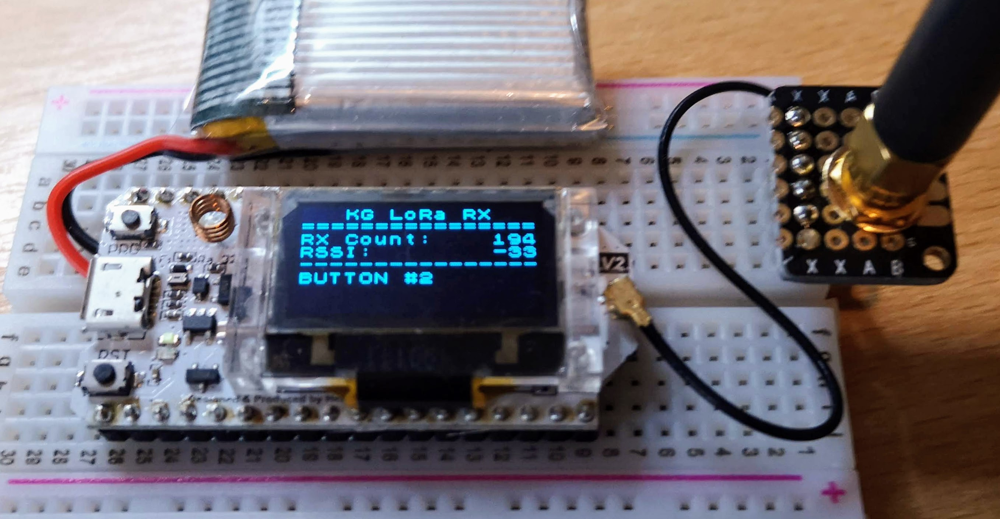

# ESP32 LoRa Receiver with OLED display

Simple receiver that displays the a count of received packets, along with the last RSSI & packet content. The packet is shown raw, with no decoding/parsing so is only really useful for ASCII text content.

## Build

This is a [Platformio](https://platformio.org/) project.

## Hardware

[MakerHawk ESP32 Dev board with built-in OLED available from Amazon](https://www.amazon.co.uk/gp/product/B076T28KWG/ref=as_li_tl?ie=UTF8&camp=1634&creative=6738&creativeASIN=B076T28KWG&linkCode=as2&tag=kgolding-21&linkId=520d100bfed7d5552f673b946220d09c)

